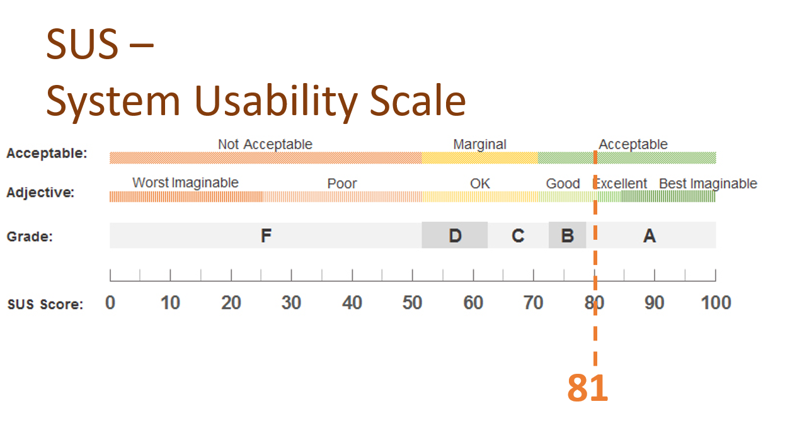
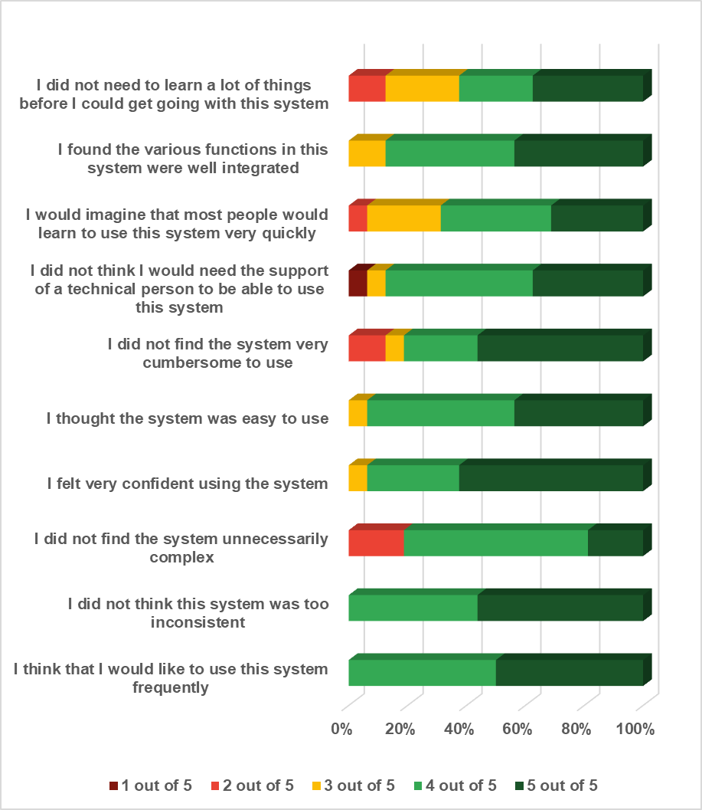

# Research Chat AI

A collaborative research paper writing platform with integrated AI assistance. Researchers can create, edit, and manage academic papers in real time, supported by AI for writing, improvement, and content analysis.

---

## Features

- **AI-Powered Writing Assistance** — Multi-provider AI support (Groq, Gemini, OpenAI, GPT-OSS) with three-dimensional personalization per paper (Lab / Personal / Global level)
- **Real-time Collaboration** — Invite collaborators, assign roles (viewer, editor, co-author), and work simultaneously via WebSocket
- **PDF Analysis** — Upload and analyze PDFs with NLP features (sentence length, vocabulary complexity, passive voice ratio, citation density, and more)
- **Section-based Editor** — Structured paper editing with sections (Introduction, Methodology, Results, etc.)
- **Comments & Review** — Inline comments per section with real-time notifications
- **Export** — Export papers to PDF, Word (.docx), and LaTeX (.tex)
- **Version Control** — Track paper versions over time
- **Analytics** — Paper progress tracking, word count, and writing statistics
- **Notifications** — Real-time notifications for collaboration invites, comments, and updates

---

## Tech Stack

| Layer | Technology |
|---|---|
| Frontend | React 19, TypeScript, Vite, TailwindCSS |
| Backend | FastAPI (Python 3.11), SQLAlchemy 2.0 (async) |
| Database | PostgreSQL 15 |
| AI Providers | Groq (Llama 3.3 70B), Gemini 2.5 Flash, OpenAI GPT-4, GPT-OSS 120B |
| Real-time | WebSocket (FastAPI) |
| Deployment | Docker, Docker Compose |

---

## Usability Evaluation

The platform has been evaluated using the System Usability Scale (SUS) methodology with research users.

**SUS Score: 80.78 / 100** — Grade A (Excellent)

<p align="center">
  
</p>



Key findings from user testing:
- ✅ Easy to learn and use without extensive training
- ✅ Well-integrated functions across the system
- ✅ Quick learning curve for most users
- ✅ No technical support needed for basic operations
- ✅ Not cumbersome to use
- ✅ High user confidence and system consistency
- ✅ Users express willingness to use the system frequently

The SUS score of 80.78 places the platform in the **"Excellent"** category (top 10% of systems), indicating strong usability and user satisfaction.

---

## Requirements

- [Docker](https://docs.docker.com/get-docker/) 24+
- [Docker Compose](https://docs.docker.com/compose/) v2+

---

## Installation

### 1. Clone the repository

```bash
git clone <repository-url>
cd research-chat-ai
```

### 2. Create the environment file

```bash
cp .env.example .env
```

Edit `.env` and fill in your values:

```env
# Database
POSTGRES_DB=research_chat
POSTGRES_USER=postgres
POSTGRES_PASSWORD=your_secure_password

# Security
SECRET_KEY=your-secret-key-change-this-in-production

# AI Services (add the keys for the providers you want to use)
GROQ_API_KEY=your_groq_api_key
GEMINI_API_KEY=your_gemini_api_key
OPENAI_API_KEY=your_openai_api_key
GPT_OSS_API_KEY=your_gpt_oss_api_key
GPT_OSS_BASE_URL=your_gpt_oss_base_url

# Email (optional - for collaboration invites)
RESEND_API_KEY=your_resend_api_key
EMAIL_FROM=noreply@your-domain.com

# CORS - add your server IP or domain
ALLOWED_ORIGINS=http://localhost:3001,http://your-server-ip:3001

# Frontend URL
FRONTEND_URL=http://localhost:3001
```

### 3. Build and start the containers

```bash
docker compose up -d --build
```

This will start 3 containers:
- `research-chat-db` — PostgreSQL database on port `5433`
- `research-chat-backend` — FastAPI backend on port `8090`
- `research-chat-frontend` — React frontend on port `3001`

### 4. Open the app

```
http://localhost:3001
```

---

## Common Commands

```bash
# Start
docker compose up -d

# Stop
docker compose down

# Rebuild after code changes
docker compose up -d --build

# View logs
docker compose logs -f

# View logs for a specific service
docker compose logs -f backend
docker compose logs -f frontend

# Restart a single service
docker compose restart backend
```

---

## Project Structure

```
research-chat-ai/
├── backend/                  # FastAPI application
│   ├── app/
│   │   ├── api/v1/endpoints/ # REST API endpoints
│   │   ├── models/           # SQLAlchemy database models
│   │   ├── schemas/          # Pydantic request/response schemas
│   │   ├── services/         # Business logic & AI services
│   │   └── core/             # Config, security, exceptions
│   ├── Dockerfile
│   └── requirements.txt
├── frontend/                 # React application
│   ├── src/
│   │   ├── paper/            # Paper editor components
│   │   ├── services/         # API communication
│   │   └── utils/            # Helpers
│   ├── Dockerfile
│   └── package.json
├── docker-compose.yml
└── .env
```

---

## API

The backend API is available at `http://localhost:8090/api/v1`.

Interactive API documentation (Swagger UI):
```
http://localhost:8090/docs
```

---

## Environment Variables Reference

| Variable | Description | Default |
|---|---|---|
| `POSTGRES_DB` | Database name | `research_chat` |
| `POSTGRES_USER` | Database user | `postgres` |
| `POSTGRES_PASSWORD` | Database password | `changeme` |
| `SECRET_KEY` | JWT secret key | — |
| `ACCESS_TOKEN_EXPIRE_MINUTES` | JWT expiry | `30` |
| `GROQ_API_KEY` | Groq API key | — |
| `GEMINI_API_KEY` | Google Gemini API key | — |
| `OPENAI_API_KEY` | OpenAI API key | — |
| `GPT_OSS_API_KEY` | GPT-OSS API key | — |
| `GPT_OSS_BASE_URL` | GPT-OSS base URL | — |
| `ALLOWED_ORIGINS` | Allowed CORS origins | `http://localhost:3001` |
| `RESEND_API_KEY` | Email service key (optional) | — |
| `FRONTEND_URL` | Frontend URL for OAuth redirects | `http://localhost:3001` |
